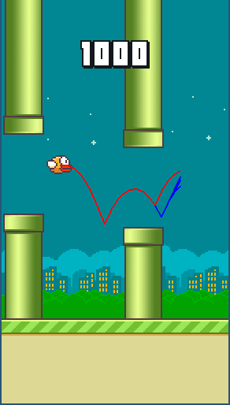

AI-FlappyBird
===============

A Flappy Bird Clone made using [python-pygame][1] and played by an AI.
Base game from [here](https://github.com/sourabhv/FlapPyBird).

How-to
------

1. Install Python > 3.5.x

2. Install PyGame 1.9.X from [here](http://www.pygame.org/download.shtml)

3. Run `./flappy.py` from the repo's directory, to get all available options run `./flappy.py --help`.

5. If you really want, u can use <kbd>&uarr;</kbd> or <kbd>Space</kbd> key to play yourself but it is strongly discouraged. Press <kbd>Esc</kbd> to close the game and <kbd>m</kbd> to mute the sound.

ScreenShots
-----------

 

[1]: http://www.pygame.org
